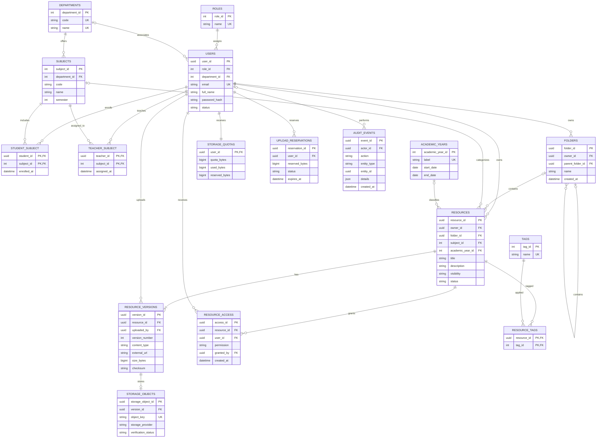

```mermaid

erDiagram
    ROLES ||--o{ USERS : assigns
    DEPARTMENTS o|--o{ USERS : associates
    DEPARTMENTS ||--o{ SUBJECTS : offers

    USERS ||--o{ STUDENT_SUBJECT : enrolls
    SUBJECTS ||--o{ STUDENT_SUBJECT : includes

    USERS ||--o{ TEACHER_SUBJECT : teaches
    SUBJECTS ||--o{ TEACHER_SUBJECT : assigned_to

    USERS ||--o{ FOLDERS : owns
    FOLDERS o|--o{ FOLDERS : contains

    USERS ||--o{ RESOURCES : owns
    FOLDERS o|--o{ RESOURCES : contains
    SUBJECTS o|--o{ RESOURCES : categorizes
    ACADEMIC_YEARS o|--o{ RESOURCES : classifies

    RESOURCES ||--|{ RESOURCE_VERSIONS : has
    USERS ||--o{ RESOURCE_VERSIONS : uploads
    RESOURCE_VERSIONS ||--o| STORAGE_OBJECTS : stores

    USERS ||--|| STORAGE_QUOTAS : receives
    USERS ||--o{ UPLOAD_RESERVATIONS : reserves

    RESOURCES ||--o{ RESOURCE_ACCESS : grants
    USERS ||--o{ RESOURCE_ACCESS : receives

    RESOURCES ||--o{ RESOURCE_TAGS : tagged
    TAGS ||--o{ RESOURCE_TAGS : applied

    USERS o|--o{ AUDIT_EVENTS : performs

    ROLES {
        int role_id PK
        string name UK
    }

    DEPARTMENTS {
        int department_id PK
        string code UK
        string name UK
    }

    USERS {
        uuid user_id PK
        int role_id FK
        int department_id FK
        string email UK
        string full_name
        string password_hash
        string status
    }

    SUBJECTS {
        int subject_id PK
        int department_id FK
        string code
        string name
        int semester
    }

    ACADEMIC_YEARS {
        int academic_year_id PK
        string label UK
        date start_date
        date end_date
    }

    STUDENT_SUBJECT {
        uuid student_id PK, FK
        int subject_id PK, FK
        datetime enrolled_at
    }

    TEACHER_SUBJECT {
        uuid teacher_id PK, FK
        int subject_id PK, FK
        datetime assigned_at
    }

    FOLDERS {
        uuid folder_id PK
        uuid owner_id FK
        uuid parent_folder_id FK
        string name
        datetime created_at
    }

    RESOURCES {
        uuid resource_id PK
        uuid owner_id FK
        uuid folder_id FK
        int subject_id FK
        int academic_year_id FK
        string title
        string description
        string visibility
        string status
    }

    RESOURCE_VERSIONS {
        uuid version_id PK
        uuid resource_id FK
        uuid uploaded_by FK
        int version_number
        string content_type
        string external_url
        bigint size_bytes
        string checksum
    }

    STORAGE_OBJECTS {
        uuid storage_object_id PK
        uuid version_id FK
        string object_key UK
        string storage_provider
        string verification_status
    }

    STORAGE_QUOTAS {
        uuid user_id PK, FK
        bigint quota_bytes
        bigint used_bytes
        bigint reserved_bytes
    }

    UPLOAD_RESERVATIONS {
        uuid reservation_id PK
        uuid user_id FK
        bigint reserved_bytes
        string status
        datetime expires_at
    }

    RESOURCE_ACCESS {
        uuid access_id PK
        uuid resource_id FK
        uuid user_id FK
        string permission
        uuid granted_by FK
        datetime created_at
    }

    TAGS {
        int tag_id PK
        string name UK
    }

    RESOURCE_TAGS {
        uuid resource_id PK, FK
        int tag_id PK, FK
    }

    AUDIT_EVENTS {
        uuid event_id PK
        uuid actor_id FK
        string action
        string entity_type
        uuid entity_id
        json details
        datetime created_at
    }

```